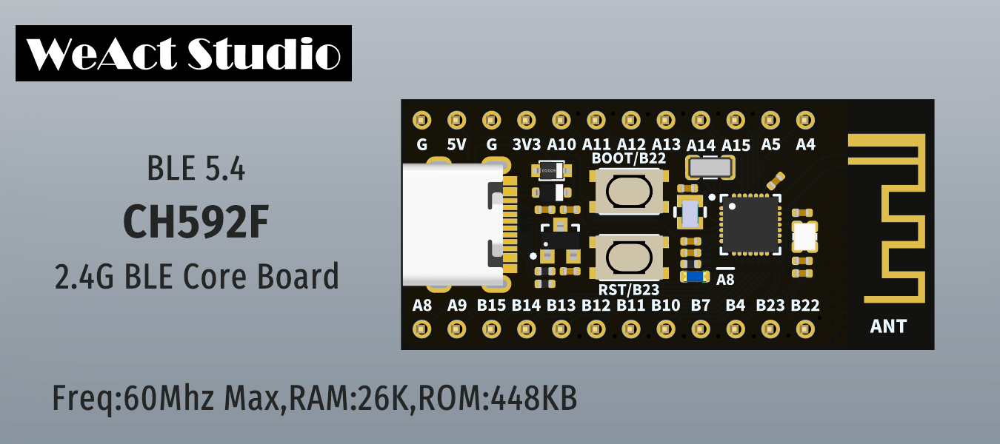

# WCH CH592F for Arduino IDE

詳しくは[GitHub](https://github.com/PEARLPALMS/Arduino-CH592F)ページへ

CH592F 用の Arduino IDE 実装ですが、実物を持ってませんので、開発環境を作っただけです(その後入手しました)。 
以下の場所に CH58x 用の実装がありますので、それに上書きする形でインストールします。 
<a href="https://github.com/ElectronicCats/arduino-wch58x">https://github.com/ElectronicCats/arduino-wch58x</a> 
動作確認は Lチカ までしか行っておりません。 
詳しいインストールは、別ページにまとめました。

> <a href="install.md">インストールからLチカまで</a>

> [インストールからLチカまで](install.md)

モノは AliExpress などで購入できますが、技適の問題もありますので、取り扱いにはご注意ください。 
2023年12月現在、230円～250円程度で販売されています。 
詳しいレビューは、別ページにまとめました。

> <a href="review.md">レビューページ</a>

# 概要 (Google翻訳) <a href="https://www.wch-ic.com/products/CH592.html">原文</a>
CH592 は、BLE ワイヤレス通信を統合した RISC-V MCU マイクロコントローラーです。2Mbps BLE通信モジュール、フルスピードUSBホストおよびデバイスコントローラおよびトランシーバ、セグメントLCDドライバモジュール、SPI、4つのシリアルポート、12チャネルADC、タッチキー検出モジュールおよびその他の豊富な周辺リソースをオンチップ統合。

# システムブロック図

# 特徴
・ QingKe 32 ビット RISC-V4C コア 
・ RV32IMAC 命令セットおよび自己拡張命令をサポート 
・ 26KB SRAM、512KB フラッシュ、ICP、ISP、IAP をサポート、OTA ワイヤレス アップグレードをサポート 
・ 内蔵2.4GHz RFトランシーバー、ベースバンドおよびリンク制御、BLE5.4をサポート 
・ 2Mbps、1Mbpsをサポート 
・ -95dBm RX 感度、プログラム可能な +4.5dBm TX パワー 
・ 最適化されたプロトコルスタックとアプリケーション層APIを提供し、ネットワーキングをサポート 
・ 内蔵温度センサー（TS） 
・ 内蔵RTC、タイミングとトリガの2つのモードをサポート 
・ USB2.0フルスピードホスト/デバイス 
・ 12チャンネルタッチキー 
・ 12チャンネル12ビットADC 
・ 4 UART、1 SPI、12 チャネル PWM、1 チャネル I2C 
・ セグメントLCDドライバーインターフェイス。80 ポイント (20*4) LCD パネルをサポート 
・ 24 GPIO、そのうち 4 つは 5V 信号入力をサポート 
・ 最小サポート 1.7V 電源電圧 
・ 内蔵のAES-128暗号化および復号化、固有のチップID 
・ パッケージ: QFN32、QFN28 

# セレクションガイド

