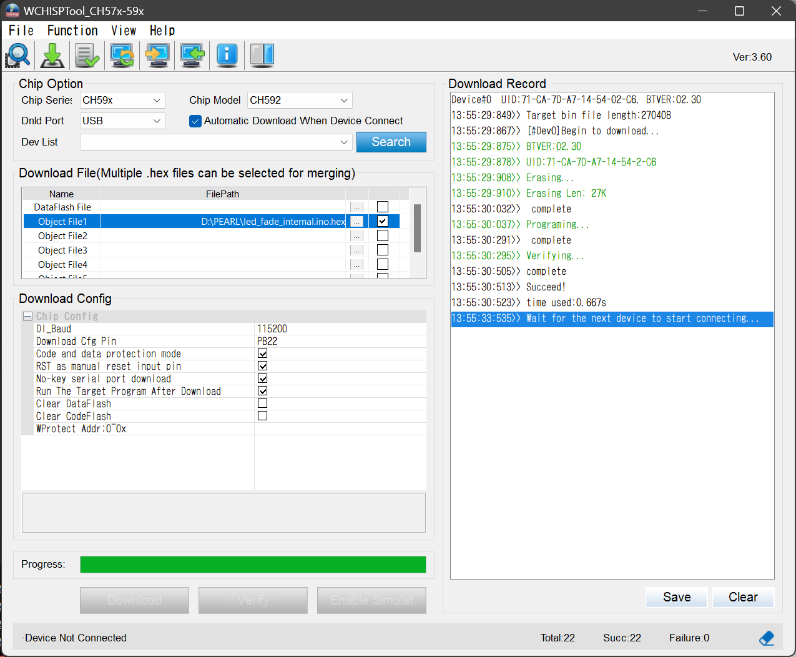

# Arduino IDE 環境作成

まず CH58x の実装を作成されている方がいらっしゃいますので、そちらをインストールします。<br>
> [https://github.com/ElectronicCats/arduino-wch58x](https://github.com/ElectronicCats/arduino-wch58x)<br>

実際は、ボードの URL を追加してパッケージをインストールする方法になりますので、詳しい方法が書かれています。<br>
> [https://github.com/ElectronicCats/arduino-wch58x/wiki/1.-First-steps-with-Arduino](https://github.com/ElectronicCats/arduino-wch58x/wiki/1.-First-steps-with-Arduino)<br>

ここまでで、CH58x が動作すると思われます。<br>
<br>

# CH592F 用ファイルを上書きインストール

以下のファイルをダウンロードし、CH58x 環境に上書きします。<br>
> [https://pearlpalms.github.io/Arduino-CH592F/electroniccats_.7z](https://pearlpalms.github.io/Arduino-CH592F/electroniccats_.7z)<br>

> [!WARNING]
> CH58x環境が壊れますので、ご注意ください。両方の実装が必要な方は、各自で切り分けを行ってください。

(そのための環境を作る必要があるので、かなり面倒だと思われます)<br>
上書き先は、環境によると思われますが、以下のディレクトリに上書きします。<br>
```
C:\Users\ユーザー名\AppData\Local\Arduino15\packages\electroniccats
```

なお以下のディレクトリーを削除する必要があります。リネームではインクルードされますので、バックアップが必要な方は、より上位の階層に移動してください。<br>
```
C:\Users\ユーザー名\AppData\Local\Arduino15\packages\electroniccats\hardware\wch\0.0.1\cores\arduino\ch583
```
<br>


# LEDのピン番号は？

基盤のシルク印刷に A8 と書かれている通り、8番ピンが LED に接続されています。PWM も使えます。<br>

```
#undef LED_BUILTIN
#define LED_BUILTIN 8
```
上記のコードを入れますが、スマートに実装するには、以下のコードが良いです。<br>

```
#ifdef ID_CH592
#undef LED_BUILTIN
#define LED_BUILTIN 8
#endif
```
<br>


# コンパイルからボードへの書き込み準備

Arduino IDE でコンパイルが完了すると、以下のエラーが出ますが、問題ありません。必ず出るようにしています。<br>
```
ブートローダのファイルが指定されましたが次が不足しています：...
```

> [!IMPORTANT]
> その下に以下の記述があり、**\*.elf** ファイルの場所をメモしておきます。
```
"C:\\Users\\ユーザー名\\... "C:\\Users\\pearl\\.../led_fade_internal.ino.elf"
最大448000バイトのフラッシュメモリのうち、スケッチが24184バイト（5%）を使っています。
最大32000バイトのRAMのうち、グローバル変数が256バイト（0%）を使っていて、ローカル変数で31744バイト使うことができます。
```
<br>


# ボードへの書き込み

書き込みにはソフト WCHISPTool が必要です。以下の場所からダウンロードが可能です。<br>
デフォルトインストール先が、Cドライブ直下になりますので、嫌な方はインストール後、ファイルだけ退避してアンインストールしても構いません。<br>
> [https://www.wch-ic.com/downloads/WCHISPTool_Setup_exe.html](https://www.wch-ic.com/downloads/WCHISPTool_Setup_exe.html)<br>

> [!CAUTION]
> ここで USBコネクタ に CH592F を刺さないでください。

WCHISPTool_CH57x-59x.exe を起動し、上記でメモした **\*.elf** と同じディレクトリにある、**\*.hex** ファイルを指定します。<br>
> [!IMPORTANT]
> 必ず **ObjectFile1** に指定すること。指定するファイルは、**elfファイル** ではなく、**hexファイル** を指定すること。

ここで USBコネクタ に CH592F を差し込みますが、**BOOTボタンを押しながら差し込みます**。<br>
スイッチ付き USBハブ が無いと現実的に運用は不可能かと思われます。<br>

画像の通り、Lチカ程度であれば、1秒以下で終了します。<br>


> [!NOTE]
> デフォルトの Lチカ と区別するために、フェードする Lチカ を以下のディレクトリに置きました。<br>
> ご自由にお使いください。<br>
> とりあえず Arduino IDE 環境を作らずとも、ボードの動作テストぐらいは出来ます。<br>
> [https://github.com/PEARLPALMS/Arduino-CH592F/tree/main/sample](https://github.com/PEARLPALMS/Arduino-CH592F/tree/main/sample)<br>
