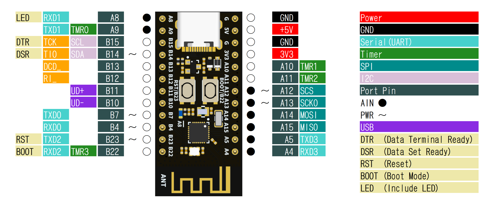
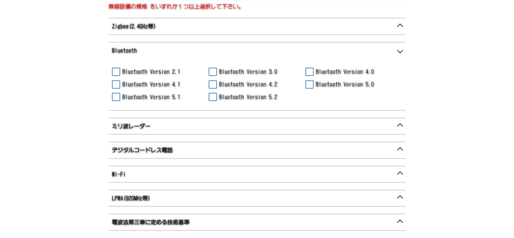

# WeAct Studio WCH CH592F

実物は以下の写真です。<br>
・ ボードは最近はやりのつや消し黒。<br>
・ コネクタは USB Type-C、スケッチのアップロードも可能。<br>
・ 裏面に実装部品なし。<br>
・ 基盤には、BOOTボタン、RESETボタン、LEDが青色1個(プラグラムで操作できる)、電源LEDは無し。<br>
・ 付属ピンは黄色で、磁石に付かない。材質は不明。<br>
・ 帯電防止袋は、なにげに嬉しいチャック付き(直ぐに捨てるんだけど)。<br>
全体的に丁寧な作りと、安っぽい梱包でなく、好感が持てる。と言ってられるのも今のうちで、
既に日本製では、同等製品を作成できないレベルだとも。。。<br>
<br>
<br>


# 詳細写真

付属ピンヘッダは、スルーホールが小さいためにギリギリ刺さる感じで、はんだの濡れが良くなく、
あらかじめフラックスたっぷりで作業するほうが良かった。STM32 付属のピンも同様だった記憶。<br>
裏面には、実装部品が皆無で、シルク印刷でデバッグピン番号が書かれている。<br>
V1.0の下にあるジャンパー部分は、分かりません。導通を確認すれば直ぐに分かるでしょうが、やってません。<br>
<br>
<br>


# ピン配列

<br>

```
==== CH592F ====
 A8       RXD1           AIN LED  | GND
 A9 TMR0  TXD1           AIN      | +5V
B15 TCK   MISO_ SCL          DTR  | GND
B14 TIO   MOSI_ SDA  PWM     DSR  | 3V3
B13 SCK0_ TXD1_ DCD_              | A10 TMR1
B12 SCS_  RXD1_ RI_               | A11 TMR2
B11 TMR2_ UD+                     | A12 SCS        PWM AIN
B10 TMR1_ UD-                     | A13 SCK0       PWM AIN
 B7       TXD0       PWM          | A14 MOSI TXD0_     AIN
 B4       RXD0       PWM          | A15 MISO RXD0_     AIN
B23 TMR0_ TXD2       PWM     RST  |  A5      TXD3      AIN
B22 TMR3  RXD2               BOOT |  A4      RXD3      AIN
```
<br>


# 大きさ比較

Nano互換と比べると、幅は同じですが、ピン数が少なくアンテナ部分を含めても小さいです。<br>
Seeeduino や ATtiny などを除けば、実用性のある小サイズだと思われます。<br>
<br>
<br>

幅が同じなので、Nanoのシールドも使えますが、ピン番号によってはショートするので、自己責任で。。。<br>
そもそも、こんな使い方する人、いませんね。<br>
<br>
<br>

# 技適マーク

そんなもん存在しません。見える場所に FCC ID、CEマーク も存在しません。
総務省のホームページで手続きが行える、「技適未取得機器を用いた実験等の特例制度」にも
Bluetooth5.2 までしか選択肢がありません。
ですので、自宅内であっても多少スピードが早くて癖のあるマイコンでしかありません。

<br>
<br>
